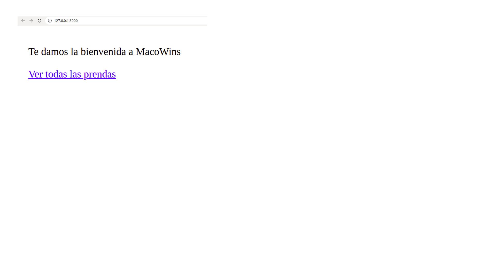
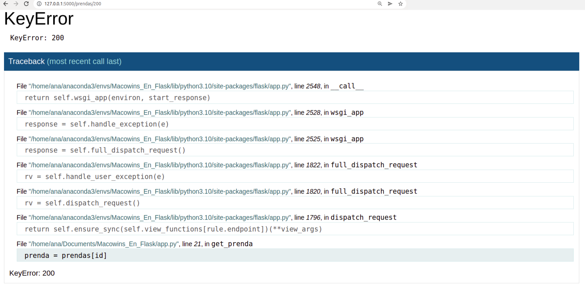

# Macowins en Flask

> Flask es un micro framework web, que nos permite la construcción de APIs y aplicaciones REST.  Está diseñado para que empezar sea rápido y fácil, con la capacidad de escalar a aplicaciones complejas. Flask ofrece sugerencias, pero no impone dependencias ni diseño de proyecto. 

## Instalación

1. Creá un proyecto nuevo: `mkdir Macowins_En_Flask && cd Macowins_En_Flask`
2. Iniciá un entorno virtual usando [conda](https://docs.conda.io/projects/conda/user-guide/concepts/environments.html) o venv:
    a. `conda create --name Macowins_En_Flask` 
    b. `python3 -m venv venv`
3. Activá el entorno correspondiente:
    a. `conda activate Macowins_En_Flask`
    b. `. venv/bin/activate`
4. Instalar el paquete [`Flask`](https://flask.palletsprojects.com/en/2.2.x/): 
    a.`conda install Flask` 
    b.`pip install Flask`


## Creación del archivo de rutas

1. Creá un archivo `app.py`
2. Importá Flask e instanciá un objeto `app` de la clase `Flask`, que será nuestra forma de comunicarnos con el _framework_:

```python
from flask import Flask

app = Flask(__name__)
```

> Nota: si necesitás repasar conceptos como objetos y clases, podés hacerlo [acá](https://github.com/AJVelezRueda/Fundamentos_de_informatica/blob/master/POO/Teoria/Introducci%C3%B3n_a_POO.md) 

## Definición básica de las rutas

Nuestra aplicación Flask se compondrá de una o más rutas que expondrán los distintos recursos de nuestro sistema. Cada ruta nos dice, como mínimo dos cosas: 

1. Bajo qué URL se expondrá el recurso
2. Qué se responderá cuando se lo acceda

Para crear una ruta, deberemos definir una función que se encargará de responder a un pedido HTTP (2)...

```python
def home():
    return "<p>Te damos la bienvenida a MacoWins</p>"
```

...y la decoraremos con el decorador `@app.get` para inidicar a qué pedidos responderá (1):


```python
@app.get("/")
def home():
    return "<p>Te damos la bienvenida a MacoWins</p>"
```

En nuestro ejemplo, estamos indicándole al servidor que responda a los pedidos GET en / con el contenido HTML `"<p>Te damos la bienvenida ...</p>"`.

> 🤔 PARA PENSAR: ¿Qué es HTML? ¿porqué y cuándo será útil responder con este tipo de contenido? ¿Qué otros tipos de contenidos podríamos enviar como respuesta? Si no se te ocurre una respuesta, quizás puedas volver a revisar el apunte de [HTTP-REST](https://github.com/AJVelezRueda/Fundamentos_de_informatica/blob/master/WEB_%26_HTTP/HTTP_%26_REST.md).
>
[Nota] Si no conocés sobre HTML y maquetación Web no te preocupes, aprenderemos más en el materila sobre [maquetado Web](https://github.com/AJVelezRueda/Fundamentos_de_informatica/blob/master/WEB_%26_HTTP/maquetado.md).

## Inicio de la aplicación

Para iniciar el servidor en nuestra computadora local, se debe utilizar el comando `flask run`: 

```bash
$ flask --debug run
# si el nombre de archivo fuera diferente
# reeemplazar con el mismo sin la extensión .py
$ flask --app <nombre_de_archivo> --debug run
```

Este comando ejecutará nuestro archivo de rutas y comenzará a escuchar nuestros pedidos HTTP en el puerto `5000`:



Además, el flag `--debug` permitirá que los cambios a nuestro código se reflejen automáticamente.   


## Rutas más avanzadas

Las rutas pueden estar parametrizadas. Por ejemplo, si queremos que nuestro servidor liste todas las prendas bajo `/prendas` y muestre una prenda específica bajo rutas como `/prendas/13`, podremos escribir lo siguiente:


```python
from markupsafe import escape

@app.get("/prendas/")
def get_all_prendas():
    return f"<p>Mostrando todas las prendas</p>"

@app.get("/prendas/<id>")
# id es un parámetro de tipo string que será enviado como parte de la ruta
def get_prenda(id):
    # es importante que escapemos todo elemento provisto externamente
    # que vaya a ser incluido en nuestro HTML resultante. De lo contrario
    # estaríamos dejando nuestra aplicación vulnerable a ataques de inyección HTML
    # https://owasp.org/www-project-web-security-testing-guide/latest/4-Web_Application_Security_Testing/11-Client-side_Testing/03-Testing_for_HTML_Injection
    return f"<p>Mostrando la prenda {escape(id)}</p>"
```

Además, si queremos que los parámetros sean automáticamente validados y convertidos a un tipo de dato particular, podremos indicarlo de la siguiente forma: 

```python
@app.get("/prendas/<int:id>")
def get_prenda(id):
    return f"<p>Mostrando la prenda {escape(id)}</p>"
```

Ahora, nuestro `id` deberá ser un entero, y lo recibiremos como tal. 

## Usando datos

Los recursos que exponemos en nuestra aplicación pueden ser almacenados (persistidos) de distintas formas. Comencemos utilizando una forma de persistencia sencilla, un diccionario definido en nuestro script:

```python
prendas = {
    100: {"name": "Remera talle m", "price": 50},
    150: {"name": "Remera talle s", "price": 40}
}
```

También podríamos usar otros formatos de almacenamiento como un DataFrame. Probá levantar el ejemplo de aplicación con app_pandas, haciendo:

```console
 flask --app  app_pandas --debug run
```

que utiliza el DataFrame `prendas = pd.DataFrame({100: {"name": "Remera talle m", "price": 50}, 150: {"name": "Remera talle s", "price": 40}})` para persistir los datos del recurso _prendas_ y los expone como contenido HTML: `<p>Mostrando prendas {prendas.to_html()}</p>`

Si bien esta forma de persistencia nos resulta sencilla a la hora de aprender, no es cómoda cuando se trabaja con un grán número de recursos. Es por ello que en general se suelen utilizar [bases de datos](https://bdigital.uvhm.edu.mx/wp-content/uploads/2020/05/Bases-de-Datos.pdf), que son herramientas que permiten recopilar y organizar información.


## Una contribución 


## Plantillas

Generar el HTML directamente en el archivo de rutas puede ser cómo para empezar, pero rápidamente se vuelve engorroso a medida que se torna más complejo y agregamos tags. Entonces nos convendrá extraer esos HTMLs a un archivo aparte, llamado plantilla (template, en inglés). 

Por ejemplo, si queremos ahora llevar nuestro HTML de home a una plantilla, deberemos crear un directorio `templates` y dentro de éste, un archivo `home.html` con el siguiente código:

```html
<!doctype html>
<p>Te damos la bienvenida a MacoWins</p>
```

...y debemos alterar nuestra función home así: 

```python
@app.get("/")
def home():
    return render_template("home.html")
```

De esta forma, estaremos instruyendo a Flask que al recibir un pedido GET a /, dibuje el contenido de `home.html`. 

Si bien este primer ejemplo es completamente estático (es decir, no está parametrizado de ninguna forma), podemos generar también contenido dinámico. Para ello aprovecharemos la sintaxis de [jinja](https://jinja.palletsprojects.com/en/3.1.x/):

```hbs
<!doctype html>
<p>Mostrando la prenda {{ id }}</p>
<p>La prenda vale ${{ prenda.price }}</p>
```

Como vemos, podemos agregar a nuestros archivos HTML parámetros. Éstos los pasaremos desde nuestro archivo de rutas: 

```python
@app.get("/prendas/<int:id>")
def get_prenda(id):
    prenda = prendas[id]
    return render_template('prenda.html', id=id, prenda=prenda)
```

Pero ¿qué sucede si intentamos acceder a la prenda `200`? Bueno, como has podido ver obtenemos un error:



Esto es porque aún no le hemos dicho al servidor qué debe hacer en el caso de no encotrar el recurso que le han pedido, ni cómo comunicar esta situación. Podemos hacer una pequeña modificación a nuestra función `get_prenda` para que ante la posibilidad de recibir un pedido sobre un recurso que no se encuentra disponible, dé una respuesta más informativa:

```python
@app.get("/prendas/<int:id>")
def get_prenda(id):
    if id in prendas:
        prenda = prendas[id]
        return render_template('prenda.html', id=id, prenda=prenda)
    else:
        return ("no hay prenda", 404)
```

### URLs Dinámicas
Cómo hemos visto en la sección anterior, podemos crear una URL para acceder a cada recurso, utilizando parámetros. Sin embargo, la construcción de las URL puede hacerse de forma dinámica para una función específica, utilizando la función `url_for()`. `url_for()` toma como primer argumento el nombre de la función, y luego como segundo argumento cualquier número de argumentos de palabras clave correspondientes a la parte variable de la URL:

```html
<!doctype html>
<p>Te damos la bienvenida a MacoWins</p>
<a href="{{ url_for('get_all_prendas') }}">Ver todas las prendas</a>
```

Esta función es útil ya nos permita construir lar URL dinámicamente en las plantillas y vincular a más de un recurso desarrollando un mismo código genérico para todos.

En jinja, debemos hacer:

```python
@app.get("/prendas/")
def get_all_prendas():
    return render_template("prendas.html", prendas=prendas.items())
```

## ¡Ahora programamos con estilo!

Hasta ahora, nuestra aplicación consta de un script de Python, que maneja la comunicación cliente-servidor, y algunos documentos HTML, que dan la estructura del contenido de las páginas. 

Pero aún con dicha estructura, nuestro contenido se ve como un conjunto de textos en un fondo blanco. Es hora de agregar algún formato de estilo a las estructuras HTML y para ello vamos a usar CSS (hojas de estilo en cascada): 

   1- Primero debemos crear un archivo de extención `.css`, en donde anotaremos los estilos que deseamos agregar a nuestras páginas. Así como generamos una carpeta de `templates` para las distntas páginas de nuestra aplicación, necesitaremos una carpeta `statics` para las hojas de estilo `CSS`. El nombre de la carpeta tiene que ver con que `Flask` considera las hojas de estilo como archivos estáticos, es decir que no se pueden generar dinámicamente se. También se considera una buena práctica crear otra carpeta dentro de `static`, de nombre `css` donde efectivamente dejaremos nuestros archivos `css`, que puede haber tantos como nos resulten necesario para estilar nuestra aplicación.

   2- Vamos a crear la hoja de estilo y vincularla al documento `html` en cuestión, para que al cargarse la página pueda hacerlo con los estilos deseados. Para ello debemos usar la etiqueta `<link>` de HTML que nos permite vincular uno y otro documento.
   
   Intentemos entonces darle estilo a nuestra pàgina de bienvenida. para ello vamos a agregar la siguiente linea en el archivo `home.html`:

   ```html
   <link rel=stylesheet type=text/css href="{{ url_for('static', filename='css/main.css') }}">
   ```

   Y vamos a generar un archivo `main.css` dentro de `static/css`, que contenga el siguiente código:

   ```css
    p {
        color:brown
      }
   ```

   ¡Y voilà, ya tenemos nuestro casita más bonita! 😜

¡Pero esto recién comienza, si querés adentrarte más en el mundo del `maquetado Web` te invito a revisar el [próximo tutorial](https://github.com/AJVelezRueda/Fundamentos_de_informatica/blob/master/WEB_%26_HTTP/maquetado.md)!
